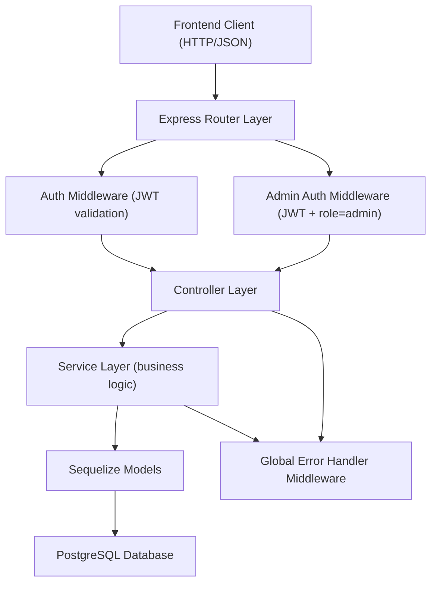
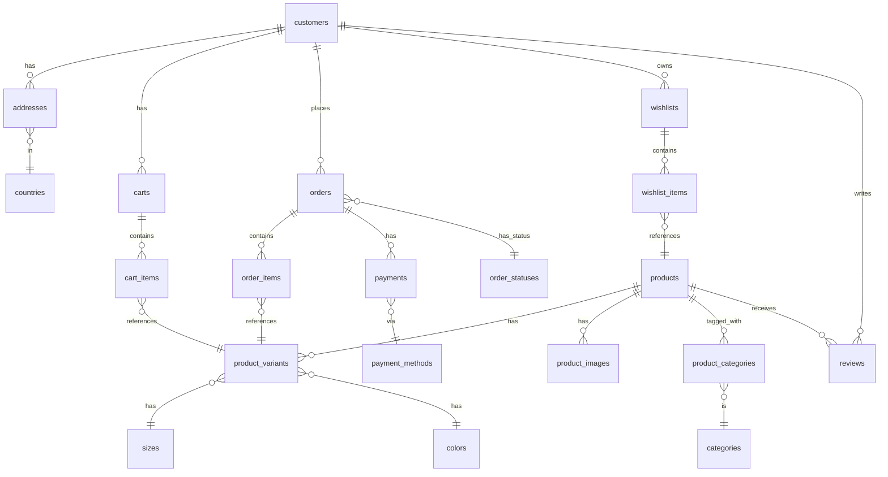

# Design Document: Lingerie E-Commerce API

## Overview

This document describes the technical design for a REST API backend serving a lingerie e-commerce platform. The API is built on the existing Express.js + Sequelize + PostgreSQL stack and exposes endpoints for customer-facing features (auth, catalog, cart, wishlist, orders, payments, reviews, profile) and admin management features (orders, products, inventory, customers).

The design follows a layered architecture: routes → middleware → controllers → services → models (Sequelize). All responses are JSON. Authentication is stateless via JWT.

---

## Architecture



### Directory Structure

```
backend/
├── config/
│   └── db.config.js
├── models/           (existing Sequelize models)
├── middleware/
│   ├── auth.middleware.js
│   └── adminAuth.middleware.js
├── controllers/
│   ├── auth.controller.js
│   ├── product.controller.js
│   ├── cart.controller.js
│   ├── wishlist.controller.js
│   ├── order.controller.js
│   ├── payment.controller.js
│   ├── review.controller.js
│   ├── customer.controller.js
│   └── admin/
│       ├── adminAuth.controller.js
│       ├── adminOrder.controller.js
│       ├── adminProduct.controller.js
│       ├── adminInventory.controller.js
│       └── adminCustomer.controller.js
├── services/
│   ├── auth.service.js
│   ├── product.service.js
│   ├── cart.service.js
│   ├── wishlist.service.js
│   ├── order.service.js
│   ├── payment.service.js
│   ├── review.service.js
│   ├── customer.service.js
│   └── admin/
│       ├── adminOrder.service.js
│       ├── adminProduct.service.js
│       ├── adminInventory.service.js
│       └── adminCustomer.service.js
├── routes/
│   ├── auth.routes.js
│   ├── product.routes.js
│   ├── cart.routes.js
│   ├── wishlist.routes.js
│   ├── order.routes.js
│   ├── review.routes.js
│   ├── customer.routes.js
│   └── admin/
│       ├── adminAuth.routes.js
│       ├── adminOrder.routes.js
│       ├── adminProduct.routes.js
│       ├── adminInventory.routes.js
│       └── adminCustomer.routes.js
├── utils/
│   └── AppError.js
└── server.js
```

---

## Components and Interfaces

### Middleware

#### `auth.middleware.js`

Validates the `Authorization: Bearer <token>` header on protected routes.

- Verifies JWT signature and expiry using `jsonwebtoken`
- Attaches `req.customer = { id, email }` on success
- Returns `401` if token is missing, malformed, or expired

#### `adminAuth.middleware.js`

Extends auth middleware with role check.

- Validates JWT (same as above)
- Checks `payload.role === 'admin'`
- Returns `401` if no valid JWT; `403` if role is not `admin`

### Route Groups

| Prefix                 | Auth                            | Description                   |
| ---------------------- | ------------------------------- | ----------------------------- |
| `/api/auth`            | None                            | Customer registration & login |
| `/api/products`        | None (GET), Auth (POST reviews) | Product catalog & reviews     |
| `/api/categories`      | None                            | Category listing              |
| `/api/sizes`           | None                            | Size listing                  |
| `/api/colors`          | None                            | Color listing                 |
| `/api/cart`            | Optional (session or JWT)       | Cart management               |
| `/api/wishlists`       | Auth                            | Wishlist management           |
| `/api/customers/me`    | Auth                            | Profile & addresses           |
| `/api/orders`          | Auth                            | Order placement & history     |
| `/api/admin/auth`      | None                            | Admin login                   |
| `/api/admin/orders`    | Admin                           | Order management              |
| `/api/admin/products`  | Admin                           | Product & variant management  |
| `/api/admin/inventory` | Admin                           | Inventory management          |
| `/api/admin/customers` | Admin                           | Customer management           |

### Controllers

Controllers handle HTTP concerns: parsing request params/body/query, calling the appropriate service, and sending the response. They do not contain business logic.

### Services

Services contain all business logic: database queries via Sequelize, validation, calculations (order totals), and state transitions (cart → order, stock_quantity → stock_status).

### `utils/AppError.js`

A custom error class extending `Error` with a `statusCode` field. Services throw `AppError` instances; the global error handler middleware catches them and formats the response.

```js
class AppError extends Error {
  constructor(message, statusCode) {
    super(message);
    this.statusCode = statusCode;
  }
}
```

### Global Error Handler

Registered as the last middleware in `server.js`. Catches all errors passed via `next(err)`:

- If `err` is an `AppError`, responds with `err.statusCode` and `{ message: err.message }`
- Otherwise responds with `500` and `{ message: 'Internal server error' }` and logs the full error

---

## Data Models

The Sequelize models already exist. This section documents the key fields and relationships relevant to the API design, plus fields that need to be added.

### Additions / Amendments Required

| Model              | Field to Add    | Type                 | Notes                       |
| ------------------ | --------------- | -------------------- | --------------------------- |
| `customers`        | `password_hash` | TEXT NOT NULL        | Stores bcrypt hash          |
| `customers`        | `is_active`     | BOOLEAN DEFAULT true | For admin soft-disable      |
| `products`         | `is_active`     | BOOLEAN DEFAULT true | Soft-delete flag (Req 14.4) |
| `product_variants` | `is_active`     | BOOLEAN DEFAULT true | Soft-delete flag (Req 14.7) |
| `admins`           | New table       | —                    | See below                   |

### `admins` Table (new)

| Column          | Type                 | Notes  |
| --------------- | -------------------- | ------ |
| `id`            | INTEGER PK           |        |
| `email`         | TEXT NOT NULL UNIQUE |        |
| `password_hash` | TEXT NOT NULL        | bcrypt |
| `created_at`    | TEXT NOT NULL        |        |

### Key Relationships



### Pagination Convention

All paginated endpoints accept `page` (default: 1) and `limit` (default: 20) query parameters. Responses include:

```json
{
  "data": [...],
  "pagination": {
    "total": 100,
    "page": 1,
    "limit": 20,
    "totalPages": 5
  }
}
```

### Standard Response Shapes

Success:

```json
{ "data": { ... } }
```

Error:

```json
{ "message": "Descriptive error message" }
```

---

## Correctness Properties

_A property is a characteristic or behavior that should hold true across all valid executions of a system — essentially, a formal statement about what the system should do. Properties serve as the bridge between human-readable specifications and machine-verifiable correctness guarantees._

### Property 1: Registration–Login Round Trip Preserves Identity

_For any_ valid registration payload (first name, last name, unique email, password), registering and then logging in with the same credentials SHALL return a JWT whose decoded `id` and `email` claims match the created customer record.

**Validates: Requirements 1.1, 1.3**

---

### Property 2: Passwords Are Never Stored in Plaintext

_For any_ customer registration, the `password_hash` value stored in the database SHALL NOT equal the plaintext password provided during registration.

**Validates: Requirements 1.1**

---

### Property 3: Auth Middleware Rejects All Invalid Tokens on Protected Routes

_For any_ protected route and any request carrying a missing, malformed, expired, or tampered JWT, the API SHALL return a 401 Unauthorized response and SHALL NOT execute the route handler.

**Validates: Requirements 1.5, 1.6**

---

### Property 4: Admin JWT Always Contains the `admin` Role Claim

_For any_ successful admin login, the returned JWT SHALL contain a `role` claim equal to `"admin"`, and decoding that token SHALL yield the admin's `id` and `email`.

**Validates: Requirements 12.1**

---

### Property 5: Admin Middleware Enforces Role on Every Admin Route

_For any_ admin-protected route, a request carrying a valid customer JWT (role claim absent or not `"admin"`) SHALL receive a 403 Forbidden response, and a request with no valid JWT SHALL receive a 401 Unauthorized response.

**Validates: Requirements 12.3, 12.4, 12.5**

---

### Property 6: Cart Item Deduplication — Quantities Are Summed, Not Duplicated

_For any_ cart and any product variant, adding that variant to the cart twice with quantities `q1` and `q2` SHALL result in exactly one `cart_item` record for that variant with `quantity = q1 + q2`, never two separate records.

**Validates: Requirements 4.4**

---

### Property 7: Cart Item Quantity Update Round Trip

_For any_ existing cart item and any positive integer quantity `q`, updating the item's quantity to `q` and then fetching the cart SHALL return that item with `quantity = q`.

**Validates: Requirements 4.5**

---

### Property 8: Order Total Calculation Invariant

_For any_ order created from a cart, the order's `subtotal` SHALL equal the sum of `unit_price × quantity` across all order items, and `total` SHALL equal `subtotal + tax + shipping`. This invariant must hold regardless of the number of items, prices, or quantities in the cart.

**Validates: Requirements 7.2**

---

### Property 9: Order Creation Transitions Cart and Sets Pending Status

_For any_ active cart belonging to the authenticated customer, placing an order SHALL atomically set the new order's status to `pending`, set the cart's status to `converted`, and set the cart's `converted_order_id` to the new order's id.

**Validates: Requirements 7.1**

---

### Property 10: Completed Payment Transitions Order to Paid

_For any_ order in any status, recording a payment with `status = "completed"` against that order SHALL update the order's status to `paid`. Recording a payment with any other status SHALL NOT change the order's status to `paid`.

**Validates: Requirements 8.3**

---

### Property 11: Customer Resource Isolation

_For any_ two distinct customers A and B, customer A SHALL receive a 403 Forbidden response when attempting to read or modify any resource (order, wishlist, address) that belongs to customer B. This property must hold for all resource types that are scoped to a customer.

**Validates: Requirements 5.6, 6.5, 7.4, 7.7, 8.2**

---

### Property 12: Stock Quantity–Status Consistency Invariant

_For any_ product variant, after any inventory update:

- If `stock_quantity = 0`, then `stock_status` SHALL be `"out_of_stock"`.
- If `stock_quantity > 0`, then `stock_status` SHALL be `"in_stock"`.

These two conditions are mutually exclusive and exhaustive for non-negative quantities.

**Validates: Requirements 15.2, 15.3**

---

### Property 13: SKU Uniqueness Constraint

_For any_ existing product with SKU `s`, attempting to create a second product with the same SKU `s` SHALL return a 409 Conflict response, and no duplicate product record SHALL be created in the database.

**Validates: Requirements 14.2**

---

### Property 14: Review Rating Is Always Within the Valid Range

_For any_ review creation request, if the `rating` value is an integer in the closed range [1, 5], the review SHALL be created and persisted with that exact rating. If the `rating` is outside [1, 5], the API SHALL return a 400 Bad Request and no review record SHALL be created.

**Validates: Requirements 9.1, 9.2**

---

### Property 15: At Most One Default Shipping Address Per Customer

_For any_ customer with one or more addresses, after setting any address as `is_default_shipping = true`, exactly one address for that customer SHALL have `is_default_shipping = true` — all others SHALL have `is_default_shipping = false`. This invariant must hold regardless of how many addresses the customer has.

**Validates: Requirements 6.6**

---

### Property 16: Profile Response Never Exposes Password Hash

_For any_ customer, any API response that includes customer profile data (from `/api/customers/me`, `/api/admin/customers`, or `/api/admin/customers/:customerId`) SHALL NOT contain a `password_hash` field or any equivalent plaintext or hashed credential.

**Validates: Requirements 10.1, 16.1, 16.3**
